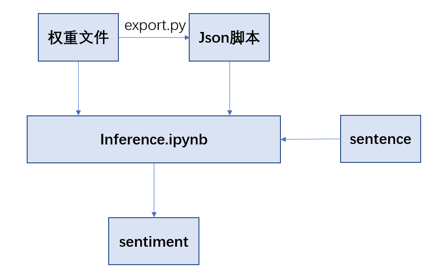

# NLP_BERT
 Finetuning of pretrained Bert

## Datasets

- waimai_10k--- 外卖平台用户评价数据集，2分类；
- ChnSentiCorp---网购评论，2分类
- weibo_senti_100k--- 微博用户评论数据集，2分类；
- weibo2---微博用户评论数据集，4分类；

## Training

利用CPU训练： python finetune_classifier.py --seed 6 --task_name xxx --batch_size 32 --epochs 4 --lr 2e-5 --bert_dataset wiki_cn_cased

可选task_name：CNSA(代表waimai_10k), ChnSentiCorp, weibo(代表weibo_senti_100k), weibo2, LCQMC

注：可以根据实际情况在batchsize参数前加入 --accumulate x 提升等效batchsize 

## Training Results

| dataset          | best epoch | accuracy | 速度(sample/s) |
| ---------------- | ---------- | -------- | -------------- |
| waimai_10k       | 1          | 0.9092   | 24.97          |
| ChnSentiCorp     | 3          | 0.9392   | 18.70          |
| weibo_senti_100k | 1          | 0.9789   | 16.99          |
| weibo2 (acc=1)   | 1          | 0.6212   | 16.47          |
| weibo2 (acc=2)   | 1          | 0.6187   | 15.66          |
| LCQMC            | 4          | 0.8914   | 21.56          |

## Logs

所有task的训练日志均在log文件夹中。从日志文件中读取loss和accu的脚本见log.py。训练过程可视化见各png。

## Single Sentence analysis

- 精调后，利用export.py脚本导出params文件，得到json脚本；
- 将json脚本和params权重一起输入inference.ipynb中
- 输入需要判断的句子，输出该句子的情感分类
